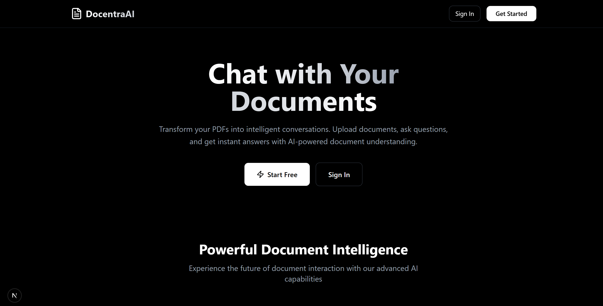
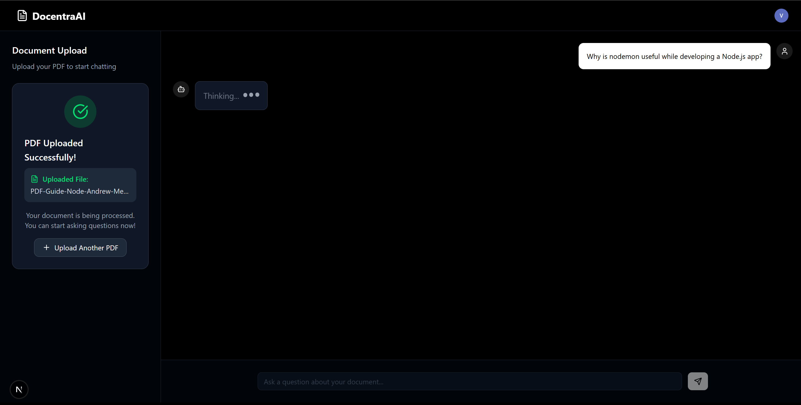
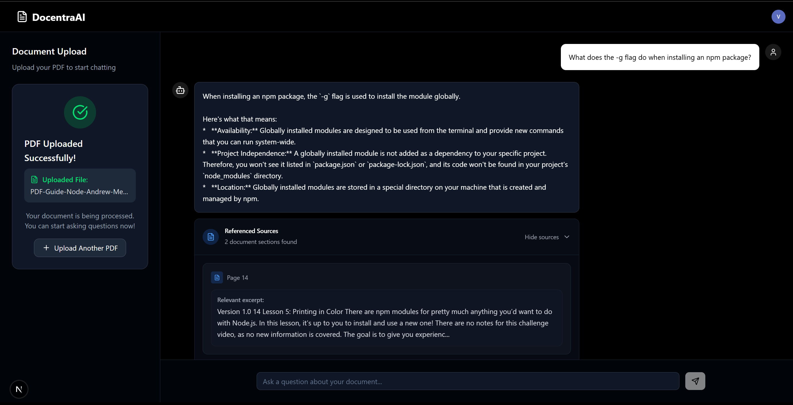

# DocentraAI

DocentraAI is a document question-answering system that enables users to upload PDF files, store their contents in a vector database, and interact with an AI assistant that retrieves context directly from the uploaded documents. It leverages Retrieval-Augmented Generation (RAG) techniques to provide accurate and context-aware responses.

---

## Overview

The system is designed as a full-stack application with the following core components:

- **Frontend (Next.js)**  
  A modern interface for uploading PDF files and chatting with the AI assistant. The frontend integrates authentication with Clerk.

- **Backend (Express.js)**  
  An API server that handles file uploads, chat requests, and manages integration with embeddings, the vector database, and the queue system.

- **Worker (BullMQ + Redis/Valkey)**  
  A background worker process responsible for parsing PDFs, generating embeddings using Google Gemini, and storing them in Qdrant.

- **Vector Database (Qdrant)**  
  Stores document embeddings for efficient retrieval and semantic search.

---

## Features

- Upload PDF files and store their contents for contextual retrieval.  
- Process PDFs in the background using a job queue for scalability.  
- Store embeddings in Qdrant for semantic search and retrieval.  
- Query the AI assistant, which responds with answers derived from document context.  
- Authentication system with Clerk to support user-based access.  

---

## Technology Stack

- **Frontend**: Next.js, React, TailwindCSS, Clerk authentication  
- **Backend**: Node.js, Express.js, Multer, BullMQ  
- **Embeddings & LLM**: Google Gemini API via LangChain  
- **Vector Database**: Qdrant  
- **Queue System**: BullMQ with Valkey (Redis-compatible)  
- **PDF Parsing**: LangChain community PDFLoader  

---

## Installation and Setup

### Prerequisites

- Node.js (v18 or later)  
- Docker and Docker Compose  
- Google Gemini API Key  
- Clerk account for authentication  

---

### Step 1: Clone the Repository

```bash
git clone https://github.com/your-username/docentraai.git
cd docentraai
```

---

### Step 2: Configure Environment Variables

#### Backend (`server/.env`)
```bash
GOOGLE_API_KEY=your_google_gemini_api_key
URL=http://localhost:6333   # Qdrant instance URL
```

#### Frontend (`client/.env`)
```bash
NEXT_PUBLIC_CLERK_FRONTEND_API=your_clerk_frontend_api
CLERK_SECRET_KEY=your_clerk_secret_key
```

---

### Step 3: Start Services

Use Docker Compose to start Valkey (Redis-compatible) and Qdrant:

```bash
cd docentraai
docker-compose up -d
```

- **Valkey** is available at `localhost:6379`  
- **Qdrant** is available at `localhost:6333`  

---

### Step 4: Install Dependencies

#### Frontend
```bash
cd client
npm install
npm run dev
```

Frontend will be available at:  
`http://localhost:3000`

#### Backend
```bash
cd server
npm install
npm run dev
```

Backend API will be available at:  
`http://localhost:8000`

#### Worker
```bash
cd server
npm run worker
```

---

## Usage

1. Run the backend, frontend, and worker processes.  
2. Open the frontend application at `http://localhost:3000`.  
3. Sign in using Clerk authentication.  
4. Upload a PDF file through the file upload interface.  
5. The worker will process the file in the background, split the text, and store embeddings in Qdrant.  
6. Use the chat interface to ask questions about the uploaded document. The AI will return answers with context retrieved from the stored embeddings.  

---

## API Endpoints

### `GET /`
Health check endpoint for the backend.  

### `POST /upload/pdf`
Uploads a PDF file and adds a background job for processing.  

### `GET /chat?message=...`
Accepts a query string parameter `message` and returns an AI-generated response based on document context.  

---







 

